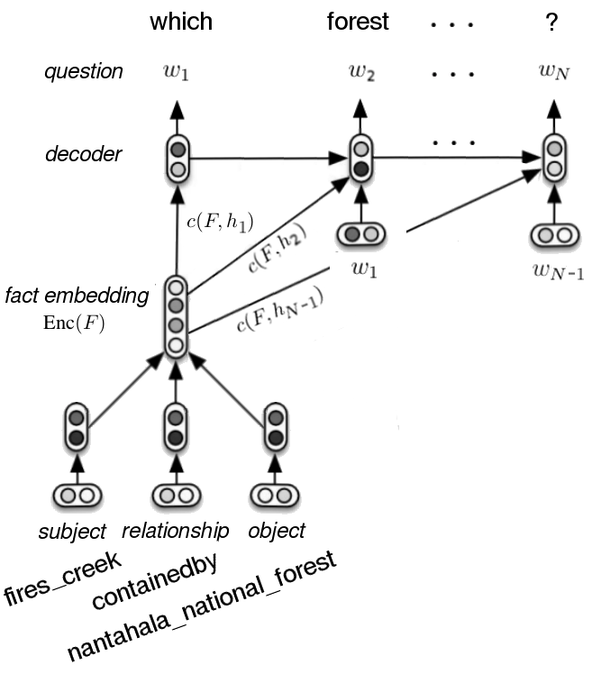

# triple2seq
Reimplementation of Serban et al.'s paper "Generating Factoid Questions With Recurrent Neural Networks: The 30M Factoid Question-Answer Corpus" at ACL'2016.

The input of the model is a knowledge triple, in form of (subject, relation, object), then it outputs a question about the subject whose answer is the object. For example, for the fact *<Microsoft, CEO, Bill Gates>*, the model may output the question *Who is the CEO of Microsoft ?*

For more detail, please refer to the original [paper](https://aclanthology.org/P16-1056/).

## Architecture



## Requirements

* PyTorch
* Numpy

## Run

```
bash run.sh
```

## TODO

* model wrapper

